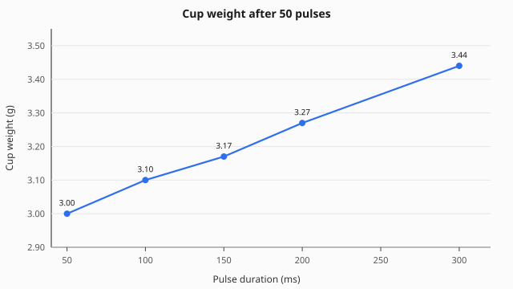
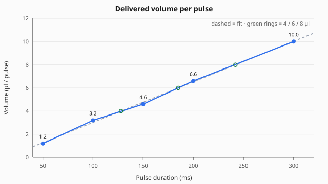

# Water volume vs valve pulse

Training rig · 8 September 2026 · `Water_Dev1` · `watertime` in the working VI.

After the line is primed and bubble-free, delivered volume is linear with pulse
length above ~100 ms:

```text
µl / pulse  =  0.0350 × t(ms)  −  0.48
```

R² = 0.998. About 14 ms of valve opening delay, then **0.035 µl per ms**
(~**30 ms per extra µl**). Do not use a single ratio through the origin; 50 ms
is less efficient.

## Use these pulse lengths

| Target drop | From the fit | Set in LabVIEW |
| --- | --- | --- |
| 4 µl | 128 ms | **130 ms** |
| 6 µl | 185 ms | **185 ms** |
| 8 µl | 242 ms | **240 ms** |

The old bench default of **200 ms was 6.6 µl**, not 4–6 µl.

## Curve

Cup weight after 50 pulses (empty cup 2.94 g):



Same data as microlitres per pulse, with the linear fit and the 4 / 6 / 8 µl targets:



## Raw measurements

Empty cup: **2.94 ± 0.02 g**. Fifty pulses per condition, caught in the cup under
the spout (tip not scraped). 1 g = 1000 µl.

| Pulse (ms) | Cup (g) | Water (g) | Total (µl) | µl / pulse | ms / µl |
| ---: | ---: | ---: | ---: | ---: | ---: |
| 50 | 3.00 | 0.06 | 60 | 1.2 | 41.7 |
| 100 | 3.10 | 0.16 | 160 | 3.2 | 31.3 |
| 150 | 3.17 | 0.23 | 230 | 4.6 | 32.6 |
| 200 | 3.27 | 0.33 | 330 | 6.6 | 30.3 |
| 300 | 3.44 | 0.50 | 500 | 10.0 | 30.0 |

Tare uncertainty ±0.02 g is about **±0.4 µl / pulse**. Fine for choosing 130 / 185 / 240 ms.

## Method notes

- Measure mass in a cup under the spout. Do not try to wick the lick tube with a
  capillary; the tip is meant to hold a film.
- Prime until bubble-free before a run. Short pulses fail if there is air in the
  line (seen 18/08/26).
- Recalibrate if the valve, tubing, height of the reservoir, or needle/spout tip
  changes.

## LabVIEW

`watertime` is still a per-trial parameter-file field (column in the 21-wide
file), not a new front-panel control. Session-constant cue / delay / spout
voltages stay on the front panel until that map is confirmed.
